# Using Microsoft Graph Project Euclid to Analyze to Find Subject Matter Experts

In this lab you will leverage Project Euclid to analyze emails from an organization in Office 365 to find subject matter experts on specific topics.

## In this lab

- [Setup tenant & get data out of Project Euclid with Data Factory](#exercise1)
- [Extract Office 365 data with Project Euclid](#exercise2)
- [](#exercise3)

## Prerequisites

To complete this lab, you need the following:

- Microsoft Azure subscription
  - If you do not have one, you can obtain one (for free) here: [https://azure.microsoft.com/free](https://azure.microsoft.com/free/)
  - The account used to signin must have the **global administrator** role granted to it.
- Office 365 tenancy
  - If you do not have one, you obtain one (for free) by signing up to the [Office 365 Developer Program](https://developer.microsoft.com/office/dev-program).
  - Multiple Office 365 users with emails sent & received
  - Access to at least two accounts that meet the following requirements:
    - global tenant administrators & have the **global administrator** role granted
    - have MFA enabled on both accounts
- Exchange Online PowerShell for multi-factor authentication installed
  - More information: [Exchange Online PowerShell for multi-factor authentication](https://docs.microsoft.com/powershell/exchange/exchange-online/connect-to-exchange-online-powershell/mfa-connect-to-exchange-online-powershell)

> NOTE: The screenshots and examples used in this lab are from an Office 365 test tenant with fake email from test users. You can use your own Office 365 tenant to perform the same steps. No data is written to Office 365. A copy of email data is extracted from all users in an office Office 365 tenant and copied to an Azure Blob Storage account that you maintain control over who has access to the data within the Azure Blob Storage.

<a name="exercise1"></a>

## Exercise 1: Setup Office 365 Tenant and Enable Euclid

Prior to leveraging Euclid for the first time, you need to configure your Office 365 tenant. This involves turning on the service and configuring a security group with permissions to approve data extraction requests. Users that will go in this group that will grant consent to data requests must have the **global administrator** role enabled.

### Grant Azure AD users the **global administrator** role and enable MFA

In this step you will ensure that two users in your Office 365 tenant have the **global administrator** role enabled and enable multi-factor authentication for one of them.

1. Open a browser and navigate to your Azure Portal at [https://portal.azure.com](https://portal.azure.com)
1. Login using an account with global administrator rights to your Azure and Office 365 tenants.
1. Select **Azure Active Directory** (Azure AD) from the sidebar navigation or using the search bar:

    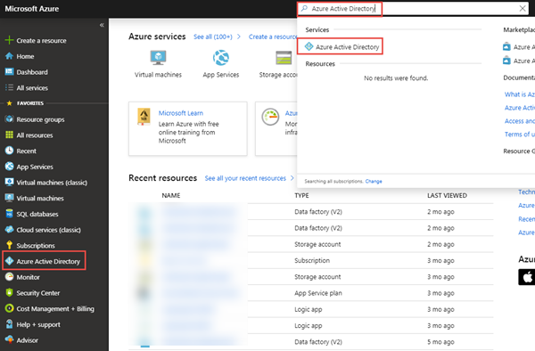

1. On the Azure AD Overview page, select **Users** from the **Manage** section of the menu:

    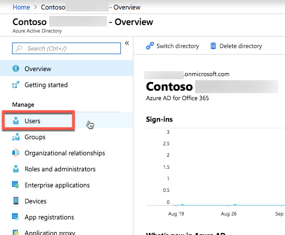

1. In the list of **All Users**, identify a user you will use in this lab that you have access to.
    1. Select the user by selecting their name.
    1. In the sidebar navigation menu, select **Directory role**.

        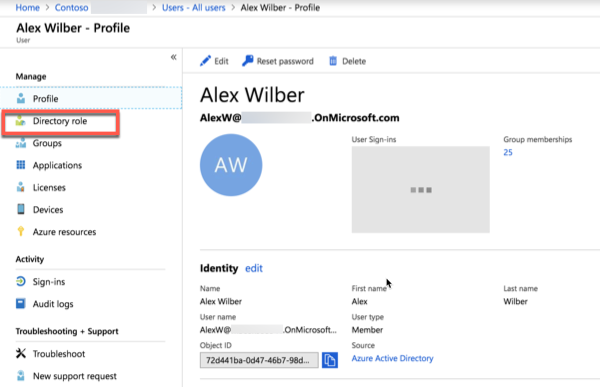

    1. If the role **Global administrator** is not in the list of roles for the user:
        1. Select **Add role** button.
        1. Locate and select the **Global administrator** role and then select the **Select** button.
    1. Repeat these steps with another user that you will use in this lab.
1. On the **Users - All Users** page, select the **Multi-Factor Authentication** button at the top of the list of users.
1. Locate one of the two users that you granted the **Global administrator** role to. Select that user.

    > This is the user that will be used to approve the Euclid data requests you will initiate later in this lab. The user approving these requests must have multi-factor authentication (MFA) enabled.

    1. In the sidebar, select the **Enable** link under the list of **Quick Steps**.

        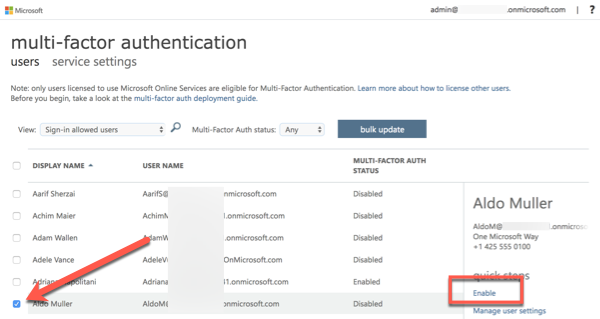

    1. Follow the prompts to enable multi-factor authentication on this user.

### Configure Euclid consent request approver group

In this step you will setup your Office 365 tenant to enable usage of Euclid.

1. Open a browser and navigate to your Microsoft 365 Admin Portal at [https://admin.microsoft.com](https://admin.microsoft.com)
1. In the sidebar navigation, select **Groups**.
1. Select the **Add a group** button.
1. Use the following to create the new mail-enabled security group and select the **Add** button.

    - **Type**: Mail-enabled security
    - **Name**: Consent Request Approvers

    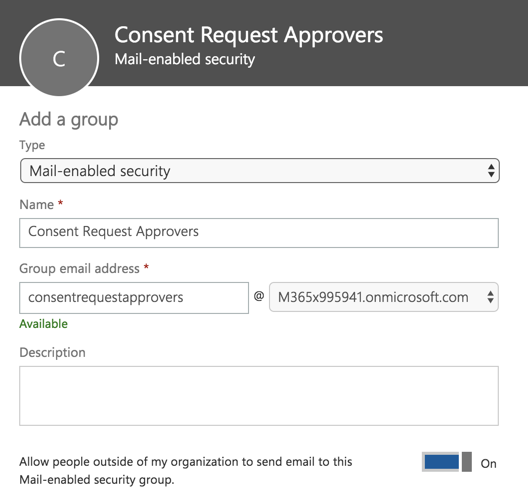

1. Once the group has been created, select it.
1. On the **Members** section of the group dialog, select **Edit**
1. Add the two users that you enabled the **Global administrator** role to this new group.

### Enable Euclid in your Office 365 tenant

In this step you will enable the Euclid service on your Office 365 tenant.

1. While you are still logged into the Microsoft 365 Admin Portal, select the **Settings > Services & Add-ins** menu item.
1. Select the **Managed access to Microsoft Graph in Microsoft Azure Preview** service.

    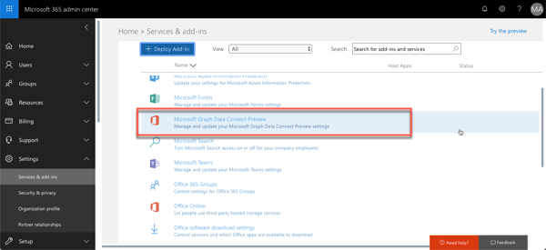

1. Enable the toggle button at the top of the dialog to **Turn Managed access to Microsoft Graph in Microsoft Azure Preview on or off for your entire organization.**
1. Enter **Consent Request Approvers** (*or the name of the group you created previously*) in the **Group of users to make approval decisions** and select **Save**.

<a name="exercise2"></a>

## Exercise 2: Extract Office 365 data with Project Euclid

In this exercise you will create, execute and approve an Azure Data Factory pipeline to extra data from Office 365 to an Azure Storage Blob for additional processing.

### Create Azure AD Application

The first step is to create an Azure AD application that will be used as the security principal to run the data extraction process.

1. Open a browser and navigate to your Azure Portal at [https://portal.azure.com](https://portal.azure.com)
1. Login using an account with global administrator rights to your Azure and Office 365 tenants.
1. Select **Azure Active Directory** (Azure AD) from the sidebar navigation.
1. On the Azure AD Overview page, select **App registrations** from the **Manage** section of the menu.
1. Select the **New application registration** button:

    

1. Use the following values to create a new Azure AD application and select **Create**:

    - **Name**: Euclid Data Transfer
    - **Application type**: Web app / API
    - **Sign-on URL**: https://[tenantid].onmicrosoft.com/EuclidDataTransfer

1. After creating the application, select it.
1. Locate the **Application ID** and copy it as you will need it later in this lab. This will be referred to as the *service principal ID*.
1. Select the **Settings** button from the top navigation.
1. Select the **Keys** menu item from the application's menu:

    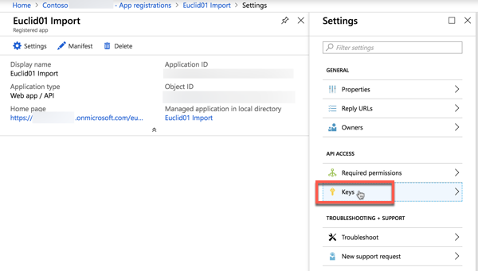

1. In the **Passwords** section, create a new key by entering a **name**, **duration** and **value** and click **Save**.

    It does not matter what you choose, but ensure you keep a copy of the name and the hashed key after it is saved as the hashed value will never be shown again and you will need to create a new key as it is needed later in the lab.

    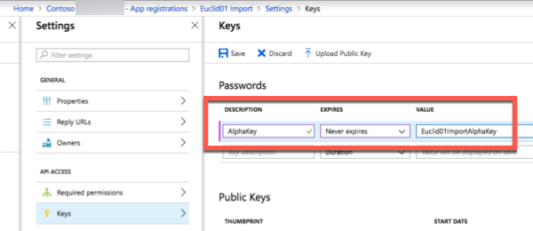

    This will be referenced as the *service principal key*.

1. Using the sidebar navigation for the application, select **Owners**.
1. Ensure your account is listed as an owner for the application. If it isn't listed as an owner, add it.
1. While you are in the Azure Active Directory within the Azure portal, obtain the Azure AD's tenant ID as you will need that later in the lab:
    1. From the Azure AD main sidebar navigation, select the **Properties** menu item.
    1. Copy the GUID for the **Directory ID** as you will need this later.

    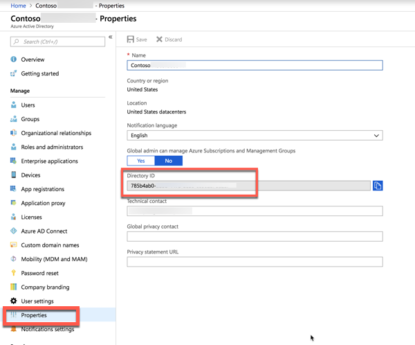

### Create Azure Storage Blob

In this step you will create an Azure Storage account where Euclid will store the data extracted from Office 365 for further processing.

1. Open a browser and navigate to your Azure Portal at [https://portal.azure.com](https://portal.azure.com)
1. Login using an account with global administrator rights to your Azure and Office 365 tenants.
1. Select **Create resource** from the sidebar navigation.
1. Find the **Storage Account** resource type and use the following values to create it, then select **Create**:
    - **Name**: *create a unique name*
    - **Deployment model**: Resource manager
    - **Account kind**: Blob storage
    - **Location**: *pick an Azure region near you*
    - **Replication**: Locally redundant storage (LRS)
    - **Performance**: Standard
    - **Secure transfer required**: Disabled
    - **Subscription**: *select your Azure subscription*
    - **Resource group**: *create / select an existing resource group*
1. Once the Azure Storage account has been created, grant the Azure AD application previously created ownership over it.
    1. Select the Azure Storage account
    1. In the sidebar menu, select **Access control (IAM)**

      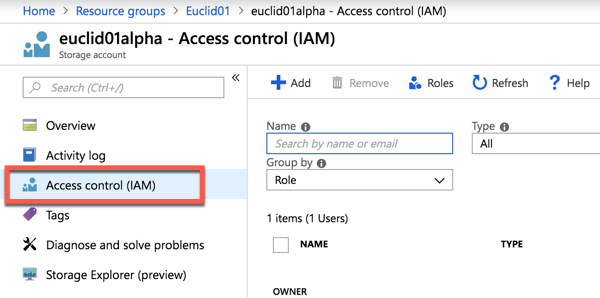

    1. Select the **Add** button in the navigation.
    1. Use the following values to find the application you previously selected to grant it **Owner** permissions, then select **Save**:

        - **Role**: Owner
        - **Assign access to**: Azure AD user, group or application
        - **Select**: Euclid Data Transfer (*the name of the Azure AD application you created previously*)
1. Create a new container in the Azure Storage account
    1. Select the Azure Storage account
    1. In the sidebar menu, select **Blobs**
    1. Select the **+Container** button at the top of the page and use the following values and then select **Ok**:
        - **Name**: maildump
        - **Public access level**: Private (no anonymous access)

### Create an Azure Data Factory Pipeline

The next step is to use the Azure Data Factory to create a pipeline to extract the data from Office 365 to the Azure Storage account using Euclid.

1. Open a browser and navigate to your Azure Portal at [https://portal.azure.com](https://portal.azure.com)
1. Login using an account with global administrator rights to your Azure and Office 365 tenants.

    > NOTE: Keep track of the user you are using in this step as you will need to switch to the other user you granted the *global administrator* role and that has *multi-factory authentication* enabled on their account in a later step.

1. Select **Create resource** from the sidebar navigation.
1. Find the **Data Factory** resource type and use the following values to create it, then select **Create**:

    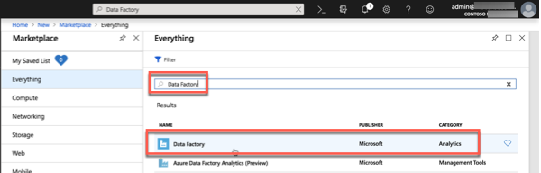

1. Use the following values to create a new Azure Data Factory resource, then select **Create**:

    - **Name**: *create a unique name*
    - **Subscription**: *select your Azure subscription*
    - **Resource group**: *create / select an existing resource group*
    - **Version**: V2
    - **Location**: *pick an Azure region near you*

1. Once the Azure Data Factory resource is created, select the **Author & Monitor** tile to launch the Azure Data Factory full screen editor.

    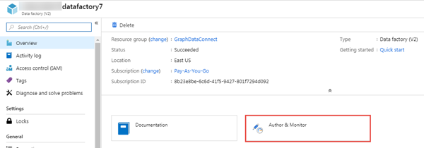

1. When the full screen editor loads, update the URL to add the following querystring feature flag to enable the Office 365 Connector and reload the browser by pressing <kbd>ENTER</kbd>.

      ```
      ?feature.office365=true
      ```

      > NOTE: This feature flag will not be required once Euclid moves from Preview to Generally Available.

1. Switch from the **Overview** to the **Author** experience by selecting it from the left-hand navigation:

    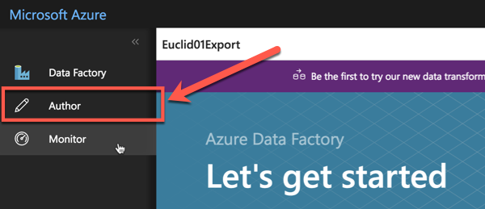

1. Create a new pipeline by selecting the plus icon, then **pipeline**:

    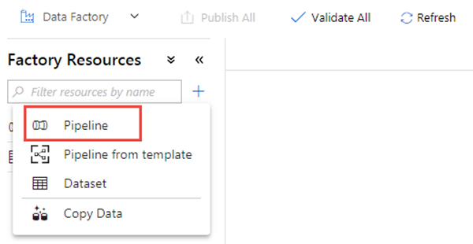

    1. Drag the **Copy Data** activity from the **Move & Transform** section onto the design surface:

        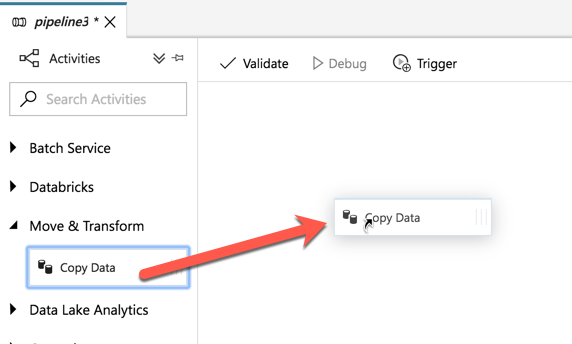

    1. Select the activity in the designer.
    1. In the activity editor pane below the designer, select the **Source** tab, then select **New**.
    1. Locate the dataset **Office 365**, select it and then select the **Finish** button.

        > NOTE: The feature flag you added to the URL earlier is what makes the **Office 365** connector appear in this step. This is only necessary when Euclid is in preview.

    1. The designer will create a new tab for the Office 365 connector. Select the **Connection** tab in the connector's editor, then the **New** button.
    1. In the dialog that appears, enter the previously created Azure AD application's **Application ID** and **Password** in the **Service principal ID** & **Service principal key** fields, then select **Finish**.

        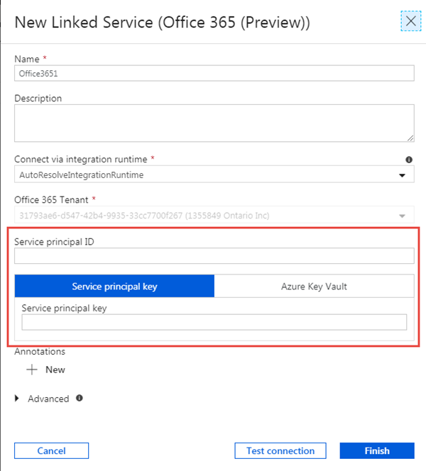

    1. After creating the Office 365 connection, for the **Table** field, select **BasicDataSet_v0.Message_v0**.

        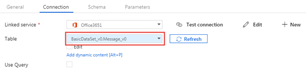

    1. Select the **Schema** tab and then select **Import Schema**.
    1. With the *source* configured for your **copy data** activity, now configure the *sink*, or the location where data will be stored.

        Select the tab in the designer for your pipeline.

    1. Select the **copy data** activity, then select the **sink** tab:

        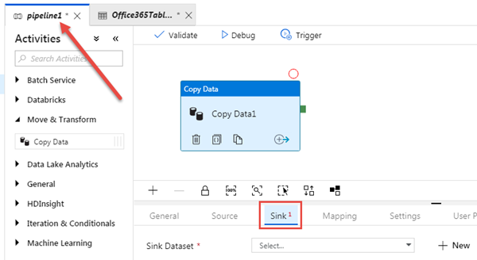

    1. Select the **New** button, then select **Azure Blob Storage**
        1. Select the **Connection** tab.
        1. Set the following values in the dialog, then select **Finish**:
            - **Authentication method**: Use account key
            - **Account selection method**: From Azure subscription
            - **Azure subscription**: *select your Azure subscription*
            - **Storage account name**: *select the storage account you previously created*

            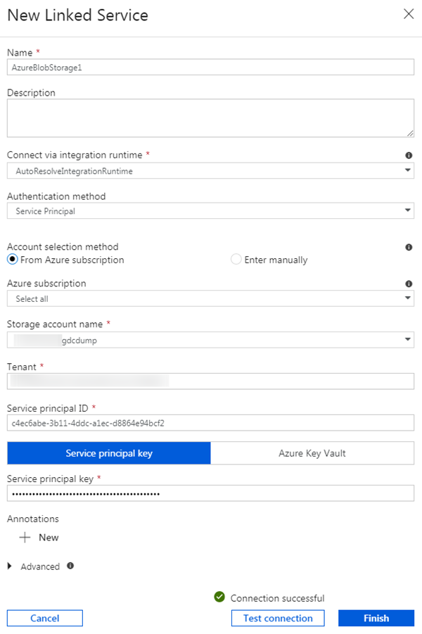

        1. Next to the **File path** field, select **Browse**.
        1. Select the name of the storage container you created previously.
        1. Set the **File format** to **JSON format**.
        1. Set the **File pattern** to **Set of objects**.

            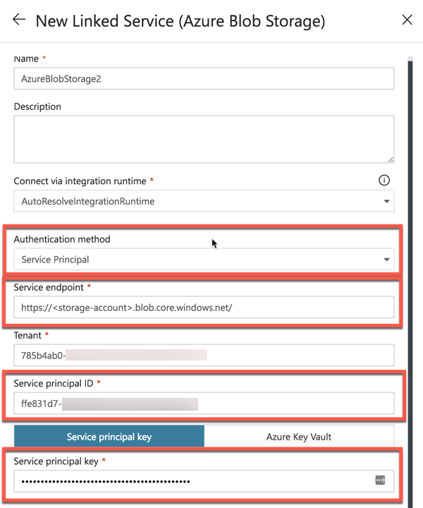

1. With the pipeline created, select the **Validate All** button at the top of the designer.
1. After validating (*and fixing any issues that were found*), select the **Publish All** button at the top of the designer.

### Execute the Azure Data Factory Pipeline

With the pipeline created, now it's time to execute it.

> NOTE: In the current Preview state, some of the tasks in this section can take a while to appear. Such as the request for consent may take 5-30 minutes for the consent request to appear and it is not uncommon for the entire process (start, requesting consent & after approving the consent completing the pipeline run) to take over 40 minutes.

1. In the Azure Data Factory designer, with the pipeline open, select **Trigger > Trigger Now**:

    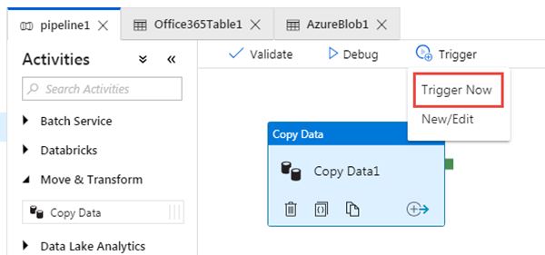

1. After starting the job, from the sidebar menu, select **Monitor** to view current running jobs:

    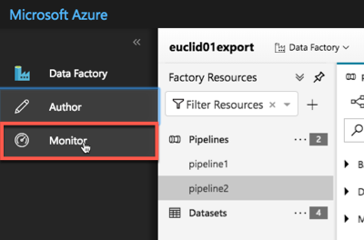

1. Locate the pipeline run you just started in the list. In the **Actions** column, select the **View Activity Runs** icon:

    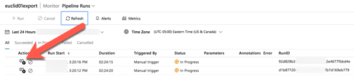

1. On the **Activity Runs** screen, you will see a list of all the activities that are running in this pipeline. Our pipeline only  has one activity that should show as currently *In Progress*.

    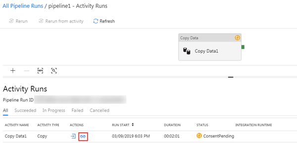

    While the status may show as *In Progress*, the request may be paused internally as the request for access to the data in Office 365 may need to be approved. You can see if this is the case by selecting the **Details** icon in the **Actions** column.

1. In the **Details** screen, look for the status of the pipeline activity as highlighted in the following image. In this case you can see it is in a state of **RequestingConsent**:

    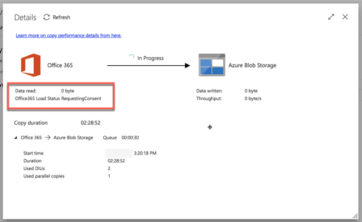

    At this point, the activity run is internally paused until someone manually approves the consent request.

### Approve Office 365 Consent Request

In this step you will use Exchange Online PowerShell to find data requests that are pending consent and approve them so the Azure Data Factory pipeline(s) can continue.

> NOTE: To complete this step, you must have installed the [Exchange Online PowerShell for multi-factor authentication](https://docs.microsoft.com/powershell/exchange/exchange-online/connect-to-exchange-online-powershell/mfa-connect-to-exchange-online-powershell) & access to a user with the **global administrator** role applied, who is a member of the group that has rights to approve requests to data in Office 365, and has multi-factor authentication enabled. This user cannot be the same user that created and started the Azure Data Factory pipeline above.

1. Open Windows PowerShell.
1. Ensure your PowerShell session has enabled remotely signed scripts:

    ```powershell
    Set-ExecutionPolicy RemoteSigned
    ```

1. Connect to Exchange Online:
    1. Obtain a login credential by executing the following PowerShell. Login using a different user than one that created & started the Azure Data Factory pipeline, who has the **global administrator** role applied, who is a member of the group that has rights to approve requests to data in Office 365, and has multi-factor authentication enabled:

        ```powershell
        $UserCredential = Get-Credential
        ```

    1. Create a new Exchange Online PowerShell session & load (import) it:

        ```powershell
        $Session = New-PSSession -ConfigurationName Microsoft.Exchange -ConnectionUri https://ps.protection.outlook.com/powershell-liveid/ -Credential $UserCredential -Authentication Basic -AllowRedirection
        Import-PSSession $Session -DisableNameChecking
        ```

        > NOTE: Once you are finished with this session, be sure you you disconnect from the session using the PowerShell command `Remove-PSSession $Session`. Exchange Online only allows for three open remote PowerShell sessions to protect against denial-of-service (DoS) attacks.
        >
        > If you simply close the PowerShell window, it will leave the connection open.

1. Get a list of all pending data requests from Euclid by executing the following PowerShell:

    ```powershell
    Get-ElevatedAccessRequest | where {$_.RequestStatus -eq 'Pending'} | select RequestorUPN, Service, Identity, RequestedAccess | fl
    ```

    Examine the list of data access requests returned. In the following image, notice there are two pending requests:

    

1. Approve a data access returned in the previous step by copying the **Identity** GUID of a request by executing the following PowerShell:

    > NOTE: Replace the GUID in the following code snippet with the GUID from the results of the previous step.

    ```powershell
    Approve-ElevatedAccessRequest -RequestId fa041379-0000-0000-0000-7cd5691484bd -Comment 'approval request granted'
    ```

1. After a few moments, you should see the status page for the activity run update to show it is now extracting data:

    

This process of extracting the data can take some time depending on the size of your Office 365 tenant as shown in the following examples:

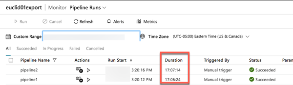

### Verify data extracted from Office 365 to Azure Storage Blob

Once the pipeline completes, verify data has been extracted to the Azure Storage Blob.

1. Open a browser and navigate to your Azure Portal at [https://portal.azure.com](https://portal.azure.com).
1. Login using an account with global administrator rights to your Azure and Office 365 tenants.
1. Select the **All resources** menu item from the sidebar navigation.
1. In the list of resources, select the Azure Storage account you created previously in this lab.
1. On the Azure Storage account blade, select **Blobs** from the sidebar menu.
1. Select the container created previously in this lab that you configured the Azure Data Factory pipeline as the sink for the extracted data. You should see data in this container now:

    

<a name="exercise3"></a>

## Exercise 3: 

